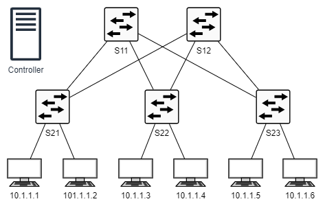
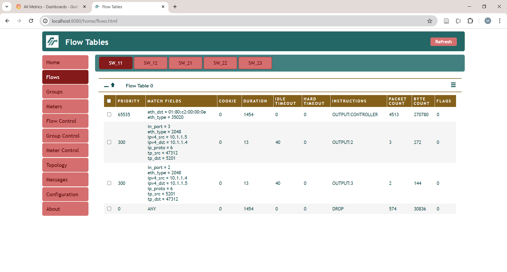

# Lab Instructions

## Background


### Spine-Leaf Topology

A Spine-Leaf topology is a two-tier network topology composed of leaf switches (ToR  switches) and spine switches. Leaf switches aggregate traffic from servers and connect to the spine layer. The spine layer is the backbone of the network, where each leaf switch is interconnected with every spine switch.

This topology is particularly useful in data centers due to its predictable performance and load balancing. The Spine-Leaf architecture allows for easy scalability - as the network grows, administrators can simply add more spine or leaf switches.

In a Spine-Leaf architecture, Software-Defined Networking (SDN) can be used to automate and simplify many network tasks, such as load balancing, failover, and scaling. It can also provide more granular control over network traffic and can implement dynamic network policies that adapt to changing network conditions and traffic patterns.
The Network

This lab environment consists of five OpenFlow switches (created using Open vSwitch), a controller (Ryu) and six hosts (servers). The Mininet emulator creates the switches and hosts, resulting in the network topology shown below.




### OpenFlow Switch Operation

At boot time, OpenFlow switches do not know how to forward packets and rely completely on the controller to provide them with instructions on how to process the packets. The controller supplies these instructions using the OpenFlow protocol. However, the controller does not generate these instructions by itself but rather translates the user’s application instructions into OpenFlow messages.

This lab includes three applications that control how packets are forwarded through the network.



### Docker Images

All applications used in the lab are housed in Docker containers. There are two Docker images used in the lab. One image includes the Mininet emulator, and the other includes the Ryu controller and the FlowManager software. The latter provide a web interface that provides user-friendly access to the OpenFlow switches. A Docker compose file is used to start, stop, and remove the container in easy manner. Both Docker images have access to Python scripts and other files that reside on the host VM, so these files are accessible inside and outside the containers.

## Starting the Lab

To start the lab, clone this repository to your local machine under folder 'sdn' then navigate to the root directory of the repository:

```bash
$ git clone https://github.com/martimy/sdn_lab sdn
$ cd sdn
sdn$ docker compose up -d
```

## Running An Application


This lab includes several Python pplications. The applications can add and modify the switch's flow entries dynamically as packets arrive from hosts to switches.

Follow the following steps to run an application:


1. In one VM terminal, change to repo folder (assume "sdn"). Edit the Docker compose file `docker-compose.yaml` to ensure it includes the following lines:

    ```bash
    $ cd sdn
    $ cat docker-compose.yaml

    # Docker Compose for SDN Lab
    services:
      # Define a "controller" service
      controller:
        image: martimy/ryu-flowmanager
        environment:
          - NETWORK_CONFIG_FILE=scripts/network_config.yaml
        command: "scripts/dc_switch_1.py --observe-links"
        volumes:
         - ./scripts:/home/auser/scripts
    ```

    The `command` line includes the name(s) of the applications that need to be apploaded to the controller. Note the FlowManager application is uploaded automatically.
    
3. Start the containers in the background:

    ```bash
    $ docker compose up -d
    ```

4. Docker will start two containers. The controller container runs the SDN controller (Ryu), the FlowManager application, which is a GUI for the controller, and the Python application `dc_switch_1.py`, which manages the switches. You can verify the controller has started successfully by checking the logs:

    ```bash
    $ docker compose logs controller
    ```

5. Next, you need to use Mininet from inside the Mininet container to create the data centre topology and interact with the hosts to send and receive traffic. Enter the mininet container using the following command:

    ```bash
    $ docker compose exec -it mininet bash
    From inside the container create the network topology described in the file ‘network_config.yaml.’
    ~# ./scripts/mn_spineleaf_topo.py scripts/network_config.yaml
    ```

   Or, without entering the container:

   ```bash
   $ docker compose exec -it mininet ./scripts/mn_spineleaf_topo.py scripts/network_config.yaml
   ```

6. At the Mininet prompt, ping between all hosts using "pingall" command. Your ping should be successful.

    ```bash
    mininet> pingall
    *** Ping: testing ping reachability
    h1 -> h2 h3 h4 h5 h6
    h2 -> h1 h3 h4 h5 h6
    h3 -> h1 h2 h4 h5 h6
    h4 -> h1 h2 h3 h5 h6
    h5 -> h1 h2 h3 h4 h6
    h6 -> h1 h2 h3 h4 h5
    *** Results: 0% dropped (30/30 received)
    ```

7. Generate using the Python code `traffic_gen.py` (you may edit the code to change the traffic generation parameters):

   ```bash
   mininet> py exec(open('scripts/traffic_gen.py').read())
   ```

7. Point your browser to `http://localhost:8080/home/` and confirm the network topology using the FlowManager's Topology view. You should see five switches and six hosts. Check also the flow tables and observe the type of flow entries that are included in the table.


  
## Stopping the lab

To stop the lab:

```bash
sdn$ docker compose down
```


