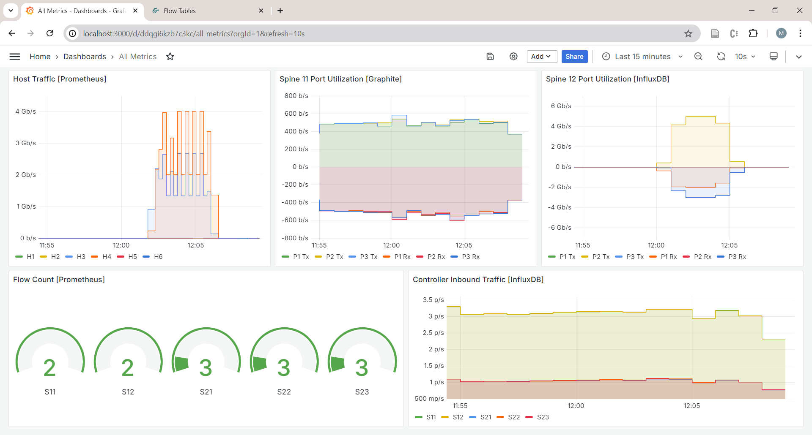
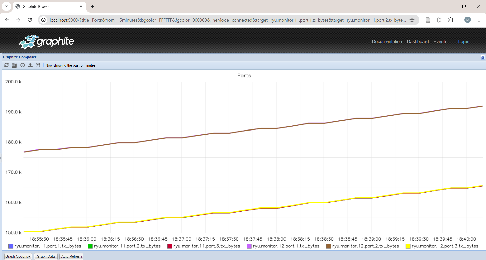

# Network Monitoring

This lab including applications for collecting network metrics and send them to Graphite, Prometheus, and InfluxDB databases. These metrics can be view using the database's own web interface or using Grafana.



## Prerequisites

Before you use Docker compose to start all services, make sure you create the directory structure needed for each service


### 1. Directory Structure

Ensure that you create the following directories:

- graphite
- prometheus
- influxdb
- grafana


### 2. Pull Docker Images

Pull the required Docker images using the following commands:

```sh
docker pull graphiteapp/graphite-statsd
docker pull prom/prometheus
docker pull influxdb:1.8
docker pull grafana/grafana:latest
```

### 3. Setup Applications and Environment Variables

Edit the `docker-compose.yaml` file to ensure the required applications are included in the `command` line. Also set the desired poll times for each application using the environment variables. The top of file should look similar to the following:

```
# Docker Compose for SDN Lab
services:
  # Define a "controller" service
  controller:
    image: martimy/ryu-flowmanager
    environment:
     - NETWORK_CONFIG_FILE=scripts/network_config.yaml
     - GRAPHITE_SERVER=graphite
     - GRAPHITE_POLLTIME=30
     - INFLUXDB_HOST=influxdb
     - INFLUXDB_POLLTIME=30
     - PROMETHEUS_POLLTIME=30
    command: "scripts/dc_switch_3.py scripts/monitor_influxdb.py \
              scripts/monitor_graphite.py scripts/monitor_prometheus.py --observe-links"
```

## Start the Services

Navigate to the directory containing the `docker-compose.yml` file and run:

```sh
docker compose --profile monitor up -d
```

This command will start all the services defined in the `docker-compose.yml` file in detached mode.

## Access the Services

- Controller: The FlowManager GUI is accessible at `http://localhost:8080/home`.
- Graphite: The Graphite web interface is accessible at `http://localhost:9000`.
- Prometheus: Access Prometheus at `http://localhost:9090`.
- Grafana: Grafana is accessible at `http://localhost:3000` with default login credentials (`admin` / `admin`).

Note that InfluxDB does not have a GUI but data can be retrieved via `http://localhost:8086`.


## Viewing Logs

To view the logs for a specific service, use:
```sh
docker compose logs <service_name>
```

For example, to view logs for the controller service:
```sh
docker compose logs controller
```

## Stopping the Services and Cleanup

To stop the services, run:
```sh
docker compose --profile monitor down
```

To remove all containers and associated volumes, use:

```sh
docker compose down -v
```

## Example: Using Graphite

To send switches telemetry to Graphite, we will need to use and application `monitor_graphite.py` with any other applications such as `dc_switch_3.py`:

1. Edit the Docker compose file `docker-compose.yaml` to add the app:

    ```bash
      # Define a "controller" service
      controller:
        image: martimy/ryu-flowmanager
        environment:
         - NETWORK_CONFIG_FILE=scripts/network_config.yaml
         - GRAPHITE_SERVER=graphite
        command: "scripts/dc_switch_3.py scripts/monitor_graphite.py --observe-links"
      ...
    ```

2. Start the containers in the background:

    ```bash
    $ docker compose --profile graphite up -d
    ```

3. Create the topology using Mininet:

    ```bash
    $ docker compose exec -it mininet ./scripts/mn_threeswitch_topo.py
    ```

4. Generate traffic between hosts. For example, you can the Python code `traffic_gen.py` to generate traffic between nodes (you may edit the code to change the traffic generation parameters):

   ```bash
   mininet> py exec(open('scripts/traffic_gen.py').read())
   ```

5. Point you browser to `localhost:9000` and select the metrics labeled `ryu.monitor`. You will see all switch ID's listed with port and flow branchs under each. Select any metric you wish to view on the graph. Graphite can create graphs from URLs as well. The file `graphite.cfg` includes two URLs. In your browser, clik on 'Create from URL' button and copy and past one of the URL in the files in the input field.


